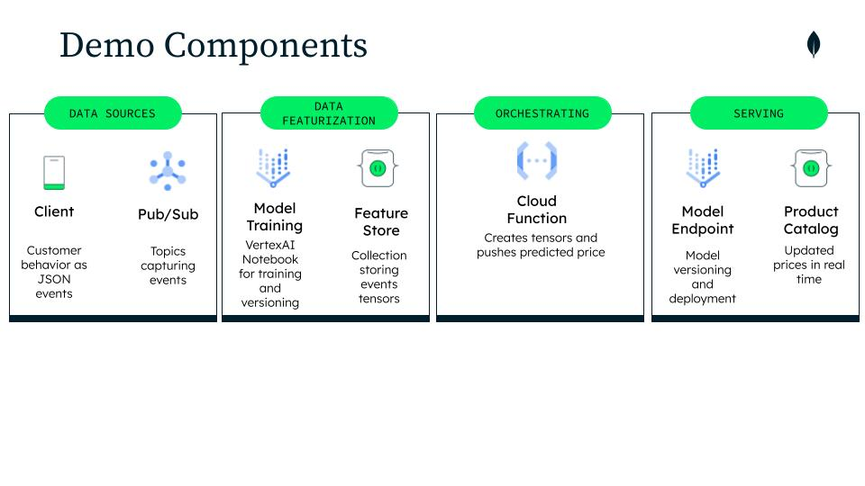

# Building a Reactive Dynamic Pricing Microservice


This guide outlines the steps to create a reactive dynamic pricing microservice using MongoDB Atlas for data storage and management, and Google Cloud Platform (GCP) for computing and hosting services.

## Data Model
We'll work with two main collections stored over MongoDB Atlas.

### Products Collection

The following table outlines the key fields, their data types, and a brief description for each.

| Field Name              | Data Type        | Description                                                                                   |
|-------------------------|------------------|-----------------------------------------------------------------------------------------------|
| `_id`                   | ObjectID         | Unique identifier for the document.                                                           |
| `name`                  | String           | Name of the product.                                                                          |
| `code`                  | String           | Unique code identifying the product.                                                          |
| `autoreplenishment`     | Boolean          | Indicates if the product is set up for auto-replenishment.                                    |
| `id`                    | Integer          | Numeric identifier for the product.                                                           |
| `gender`                | String           | Gender category the product is intended for.                                                  |
| `masterCategory`        | String           | Broad category for the product.                                                               |
| `subCategory`           | String           | More specific category under the master category.                                             |
| `articleType`           | String           | Type of article, e.g., Vest.                                                                  |
| `baseColour`            | String           | Primary color of the product.                                                                 |
| `season`                | String           | Season the product is intended for.                                                           |
| `year`                  | Integer          | Year of the product release.                                                                  |
| `usage`                 | String           | Intended use of the product, e.g., Casual.                                                    |
| `image`                 | Object           | Contains the URL of the product image.                                                        |
| `price`                 | Object           | Contains the amount and currency of the product price.                                        |
| `description`           | String           | Detailed description of the product.                                                          |
| `brand`                 | String           | Brand of the product.                                                                         |
| `items`                 | Array of Objects | Contains variants of the product, including size, stock information, and delivery time.       |
| `total_stock_sum`       | Array of Objects | Aggregated stock information across different locations.                                      |
| `pred_price`            | Double           | Predicted price of the product based on machine learning models.                              |

> [!NOTE]
> `_id` and `id`: The collection uses both an ObjectID (_id) for MongoDB's internal use and a numeric id for external reference.
> `image` Object: Contains the url field with a link to the product's image.
> `price` Object: Nested structure with amount as an integer and currency as a string.
> `items` Array: Each object within this array represents a different size or variant of the product, including stock levels at various locations and delivery times.
> `total_stock_sum` Array: Provides a summary of stock levels across different types of locations (e.g., store, warehouse) to facilitate inventory management.
> `pred_price`: This field uses a double data type to accommodate the precision required for pricing predictions.

The collection JSON objects would look like: 
```
{
  "_id": {"$oid": "65e1e313cffbb90f3409a3cd"},
  "name": "Green MongoDB Puffer Vest ",
  "code": "GMPV-MDB0001",
  "autoreplenishment": false,
  "id": {"$numberInt": "98796"},
  "gender": "Unisex",
  "masterCategory": "Apparel",
  "subCategory": "Topwear",
  "articleType": "Vest",
  "baseColour": "Green",
  "season": "Winter",
  "year": {"$numberInt": "2024"},
  "usage": "Casual",
  "image": {
    "url": "https://storage.googleapis.com/retail-product-images/storeProducts/98796.jpg?GoogleAccessId=bucket-images%40ist-retail-demo.iam.gserviceaccount.com&Expires=1712282400&Signature=MZyCwTcDoG4tHPeVkTU%2B91iQFzQAN2KYngh5luQKNE0ZueoyCoik11IeHk4YeDr%2FVCtBMawqhrtv92kxLxyUvW%2B6nEISvn6aZFkn04eW5SgbuXfu3fkqb7vVUtL6Bql%2FM%2F6FF17RATPzA3KOROUonaJF1EE2ybKYV%2BJFHigD%2BaD4enwZn78CGZesPIm2j535tmHqDmWqosbcBwqyCpA6wUTByf%2Bz7RoB6qrjynoETa8BZTbfMA4Lqru53QduFk5qZhFtRbnnpUTs5s8NE%2BKJ%2FG7MbgTmV0i5nLNXqxB8FiDARz%2B61PtWnrsl%2FhPlUpb96%2B7hDD2IOyjLd42ELazlVw%3D%3D"
  },
  "price": {
    "amount": {"$numberInt": "49"},
    "currency": "USD"
  },
  "description": "Make a statement with this vibrant green puffer vest showcasing the MongoDB logo, offering both warmth and a pop of color to your outfit, perfect for outdoor adventures or everyday wear.",
  "brand": "MongoDB",
  "items": [
    {
      "sku": "GMPV-MDB0001-S",
      "name": "S",
      "unit": "units",
      "delivery_time": {
        "amount": {"$numberInt": "3"},
        "unit": "seconds"
      },
      "stock": [
        {
          "location": {
            "type": "store",
            "id": {"$oid": "65a545fb4a8f64e8f88fb897"}
          },
          "amount": {"$numberInt": "2"},
          "threshold": {"$numberInt": "1"},
          "target": {"$numberInt": "2"},
          "ordered": {"$numberInt": "0"}
        },
        {
          "location": {
            "type": "store",
            "id": {"$oid": "65a545fb4a8f64e8f88fb896"}
          },
          "amount": {"$numberInt": "2"},
          "threshold": {"$numberInt": "1"},
          "target": {"$numberInt": "2"},
          "ordered": {"$numberInt": "0"}
        },
        {
          "location": {
            "type": "warehouse"
          },
          "amount": {"$numberInt": "20"}
        }
      ]
    },
    {
      "sku": "GMPV-MDB0001-M ",
      "name": "M ",
      "unit": "units",
      "delivery_time": {
        "amount": {"$numberInt": "3"},
        "unit": "seconds"
      },
      "stock": [
        {
          "location": {
            "type": "store",
            "id": {"$oid": "65a545fb4a8f64e8f88fb897"}
          },
          "amount": {"$numberInt": "5"},
          "threshold": {"$numberInt": "2"},
          "target": {"$numberInt": "5"},
          "ordered": {"$numberInt": "0"}
        },
        {
          "location": {
            "type": "store",
            "id": {"$oid": "65a545fb4a8f64e8f88fb896"}
          },
          "amount": {"$numberInt": "5"},
          "threshold": {"$numberInt": "2"},
          "target": {"$numberInt": "5"},
          "ordered": {"$numberInt": "0"}
        },
        {
          "location": {
            "type": "warehouse"
          },
          "amount": {"$numberInt": "50"}
        }
      ]
    }
  ],
  "total_stock_sum": [
    {
      "location": {
        "type": "store",
        "id": {"$oid": "65a545fb4a8f64e8f88fb896"}
      },
      "amount": {"$numberInt": "12"},
      "threshold": {"$numberInt": "5"},
      "target": {"$numberInt": "12"},
      "ordered": {"$numberInt": "0"}
    },
    {
      "location": {
        "type": "warehouse"
      },
      "amount": {"$numberInt": "120"}
    },
    {
      "location": {
        "type": "store",
        "id": {"$oid": "65a545fb4a8f64e8f88fb897"}
      },
      "amount": {"$numberInt": "12"},
      "threshold": {"$numberInt": "5"},
      "target": {"$numberInt": "12"},
      "ordered": {"$numberInt": "0"}
    }
  ],
  "pred_price": {"$numberDouble": "8.6975069"}
}
```
### Events Collection (Feature Store)
The purpose of this notebook is to demonstrate how to train a TensorFlow neural network model for predicting an optimal price based on e-commerce events stored in a MongoDB Atlas feature store.
Our ecommerce store has the following data model for capturing user behavior events:

| Field         | Data Type | Description                                               | Example Values           |
|---------------|-----------|-----------------------------------------------------------|--------------------------|
| product_name  | String    | The name of the product                                   | "MongoDB Notebook"       |
| product_id    | Integer   | Unique identifier for the product                         | 98803                    |
| action        | String    | Type of action performed on the product (user interaction)| "view", "add_to_cart", "purchase" |
| price         | Float     | Price of the product                                      | 18.99                    |
| timestamp     | String    | ISO format timestamp of when the event occurred           | "2024-03-25T12:36:25.428461" |
| encoded_name  | Integer   | An encoded version of the product name for machine learning models | 23363195            |

An events object, with it's associated tensors would look like: 
````
{
  "_id": "660161b999d84b36a26c164f",
  "product_name": "MongoDB Notebook",
  "product_id": 98803,
  "action": "view",
  "price": {
    "amount": 15,
    "currency": "USD"
  },
  "timestamp": "2024-03-25T12:36:25.428461",
  "encoded_name": 23363195,
  "tensor": [
    [
      0.0005624396083488047,
      -0.9579731008383453
    ]
  ]
}
````

## Demo Components
### Data Ingestion with Google Cloud Pub/Sub ###

Our solution leverages Google Cloud Pub/Sub for ingesting JSON-formatted customer behavior events. Google Cloud Pub/Sub is chosen for its scalability and ability to handle a vast influx of messages, facilitating efficient distribution across numerous subscribers. Its support for parallel processing and distribution across multiple instances makes it ideal for event-driven architectures, enhancing system responsiveness through reactive programming.

### Data Featurization with Vertex AI Notebooks and MongoDB Atlas as Feature Store ###

Data cleaning and TensorFlow model training are conducted in Vertex AI Notebooks. The TensorFlow model is designed to understand the complex relationships among customer events, product names, and prices, aiming to accurately predict optimal pricing. 

With MongoDB Atlas collections as a Feature Store, we provide a centralized, managed solution for storing and managing machine learning features. It's used to ensure consistency between training and serving features, reduce pipeline complexity, and improve reusability with version controlling data modeling patterns. You can even store your models in there! 

### Orchestration via Cloud Functions ###

Cloud Functions are utilized to orchestrate the flow of customer events from the Pub/Sub topic, transforming them into tensors for storage in a MongoDB Atlas collection. This collection serves as a feature store, a centralized repository for storing, managing, and serving features to ML models. The flexibility of MongoDB’s document model, along with document versioning, facilitates the management of time-sensitive event data and training datasets.

### Serving with Vertex AI and MongoDB ###

A Cloud Function triggers our trained TensorFlow model hosted on a Vertex AI Endpoint, using event tensors to generate predicted price scores. These scores are then integrated into our product catalog in MongoDB, enabling real-time price updates in our e-commerce application.



## Architecture
The architecture is designed to enhance pricing strategies through deep learning and continuous model optimization.

### Blue Data Flow: Real-Time Pricing Adjustment

1. __Event Ingestion:__ Customer event data is ingested into a Google Cloud Pub/Sub topic, serving as the entry point for real-time data.

2. __Data Processing:__ A Cloud Function is triggered via a push subscription from the Pub/Sub topic. This function transforms raw event data into a structured tensor format.

3. __Model Invocation and Price Update:__ The same Cloud Function calls a deployed model endpoint (e.g., in Vertex AI) with the tensor data to predict pricing. It then updates the predicted price in the MongoDB product catalog collection.


### Green Data Flow: Feature Store Building
1. __Feature Store Update:__ Concurrently, the Cloud Function pushes the tensor data into the MongoDB Events collection, which acts as a feature store. Every event has it's own tensor.

2. __Versioning and Accessibility:__ Data within the feature store is versioned, ensuring easy management and accessibility for model training and optimization. 

>[!IMPORTANT]
>Make sure to check out [this](https://www.mongodb.com/blog/post/building-with-patterns-the-document-versioning-pattern) pattern versioning guide 

## Prerequisites
+ MongoDB Atlas account
+ Google Cloud Platform account
+ Basic understanding of Node.js and Express

## Step 1: Setting Up MongoDB Atlas

>[!TIP]
>Make sure to follow [this](https://www.mongodb.com/mongodb-on-google-cloud) "How to" guide.

__Create a Cluster__: Sign in to your MongoDB Atlas account and create a new cluster. Choose a region that is closest to your user base for optimal performance.

__Configure Security__: Set up your cluster's security settings. Create database users with specific roles and enable IP whitelisting to secure your database connection.

__Connect to Your Cluster__: Use the connection string provided by Atlas to connect your application to your MongoDB database. You'll need this in the microservice configuration.

## Step 2: Setting Up GCP

>[!TIP]
>To configure your GCP project visit [this](https://developers.google.com/workspace/guides/create-project) guide.

+ __Create a GCP Project:__ Log into your Google Cloud Console and create a new project for your microservice.

+ __Enable APIs:__ Ensure that the necessary APIs are enabled for your project. In this demo we are using: 

|Service API | Explanation|
|:------------:|:------------:|
|Cloud Storage | Saving data scalers as ```.joblib``` files |
|Cloud Function | Orchestrating the data flow |
|Pub/Sub | Ingesting live streaming of ecommerce events to loosely couple subscription based microservices |
|VertexAI | Training notebook and model endpoint |

+ __Configure GCP CLI:__ Install and initialize the Google Cloud CLI. Authenticate with your GCP account and set your project as the default.

## Step 3: Developing the Microservice and Model

+ __Clone the Repository__: Start by cloning the repository with the microservice code.

```git clone https://github.com/mongodb-industry-solutions/retail-store.git```

```cd retail-store/microservices/dynamicPricing ```

+ __Configure Environment Variables:__ Set up the necessary environment variables, including your MongoDB Atlas connection string and any other service-specific configurations.

+ __Develop the Pricing Logic:__ Modify the dynamicPricing service to implement your pricing algorithm. This could involve analyzing historical data, considering competitor pricing, and integrating real-time supply-demand signals.

>[!TIP]
>If you want to try a really simple pricing algorithm check out [this jupyter notebook guide](dynamicPricing/modelTraining_notebook.ipynb). You'll need the same data model we are using in this small demo.

+ __generator.py__ This python script will generate fake customer events following the data model explained above. The events will be pushed to a Pub/Sub topic and to your Atlas feature store collection. You can tweak the number of events and their cadence directly in the code.

+ __server.py__ FastAPI server. Make sure you run ```pip install requirements.txt```in the VM or Container that will host the microservice.

+ __cloudFunction__ Google CloudFunction that will orchestrate converting events data into tensors and its input into the feature store collection as well as invoking the VertexAI Endpoint model. Make sure you add the ```requirements.txt``` file in the Cloud Function folder structure over GCP.

______________________

[Back to top](#top)

[:arrow_up:](#top)