# Setting up the RAG Chatbot experience

This README will help you re-create the chatbot experience in Leafy Portal. The chatbot consists of a few parts - 
- The web application that shows the chat interface
- The interface integrates with a Dataworkz Agent that powers the chat bot
- The Dataworkz Agent leverages Leafy Portal policies (as a pdf document) and the Leafy Portal orders data from a MongoDB database

We will bring all these together in the following steps -

## Prerequisites

Make sure to have the following tools to follow along smoothly and run this demo on your own environment.
* Install Node. This will be required to install the node modules which contain all the necessary packages to run our demo.
* Install Git. This will be required to clone the demo repository.

## Step 1. Clone the repository
Start by obtaining the demo code. Open your terminal, navigate to the directory where you want to store the code, and run the following command:

git clone https://github.com/mongodb-industry-solutions/retail-store-v2.git

## Step 2. Set up environment variables and install dependencies
Navigate to the project directory and create a file called .env.local at the root level. This file is essential for managing configuration settings, especially when it contains sensitive information such as private keys.

```bash
cd retail-store-v2
touch .env.local
```

Note: For Window’s users, replace touch .env.local with echo $null >> .env.local

Open the .env.local file that you just created, and add the following environment variables.

```bash
MONGODB_URI=
DATABASE_NAME="leafy_popup_store"
COLLECTION_NAME="orders"
NODE_ENV="development"
DATAWORKZ_SERVICE=https://ragapps.dataworkz.com
DATAWORKZ_LLM_ID=
DATAWORKZ_TOKEN=
DATAWORKZ_AGENT_ID=
```

We will fill in the blank values in the following steps.

Install the node modules executing the following command:

```bash
npm install
```

This installation might take a few moments to complete, as all the required packages are being downloaded and installed into the project. Once the command finishes executing, a new folder named ‘node_modules’ will appear at the root level of the application code, containing the installed dependencies.

## Step 3. Retrieve your connection string
A MongoDB connection string is required to connect to the cluster you created in the ‘Prerequisites’ section. 

You have 2 options to connect to MongoDB. 
1. Use a pre-configured and pre-populated read-only hosted MongoDB at Dataworkz
2. Connect to your own cluster and populate it with demo data

**Use a pre-configured MongoDB cluster from Dataworkz**

Dataworkz has hosted a MongoDB cluster that is pre-populated with data for this demo and is ready-to-use. The pre-configured MongoDB is meant only for the chatbot demo. It is a read-only database and will not be suitable for other parts of this demo. However, if you are interested in recreating the chatbot experience, it is the easiest and fastest way to get going.
Edit your .env.local file to use the following - 
The MONGODB_URI has the format: `mongodb+src://<username>:<pwd>@agenticrag.8inaw.mongodb.net`
- username : **`dataworkz`**
- password : **`agenticragmadeeasy`**

Please replace these values for `<username>` and `<pwd>` in the MONGODB_URI line below when you edit your `.env.local`
```bash
MONGODB_URI=mongodb+srv://<username>:<pwd>@agenticrag.8inaw.mongodb.net
DATABASE_NAME="leafy_popup_store"
COLLECTION_NAME="orders"
NODE_ENV="development"
...
```

**Use your own MongoDB cluster and populate data**

Create an Atlas account at https://cloud.mongodb.com and provision a Cluster. You can follow the instructions from [this article](https://www.mongodb.com/resources/products/fundamentals/mongodb-cluster-setup) to set up your Cluster.

Then, a MongoDB connection string is required to connect to the cluster you created. Follow the steps provided in [this article](https://www.mongodb.com/resources/products/fundamentals/mongodb-connection-string#:~:text=How%20to%20get%20your%20MongoDB,connection%20string%20for%20your%20cluster.) to retrieve your connection string.

You can now edit your `.env.local`
```bash
MONGODB_URI=<connection-string>
DATABASE_NAME="leafy_popup_store"
COLLECTION_NAME="orders"
NODE_ENV="development"
...
```

Lastly, lets populate the database with data. In the application code locate the dump/leafy_popup_store directory. Inside it, there are several .gz files which contain the data and metadata of the collections: users, products, orders, locations and carts.

Use the [mongorestore](https://www.mongodb.com/docs/database-tools/mongorestore/) command to load the data from the database dump into a new database within your Cluster.

Let's go back to your terminal, navigate to the directory /retail-store-v2 (the root level of the application code), and run the following command:

```
mongorestore --gzip --dir=dump/leafy_popup_store --db=leafy_popup_store --uri "mongodb+srv://<user>:<password>@<cluster-url>"
```
This command will create the database and collections and log its progress. 

You are now ready for Step 4

## Step 4. Configure Dataworkz Agent to power the chat bot
The demo chat bot is powered by Dataworkz Agents. Dataworkz Agent relies on Tools to connect it to data in databases such as MongoDB and unstructured data in documents such as store policies. In this section, we will build the Dataworkz Agent that powers this demo and use the Dataworkz's No Code Agent Builder to do that. First, there are a few things you will need.

### Pre-requisites
- A Dataworkz account at https://ragapps.dataworkz.com
- A OpenAI key for gpt-4 or an Amazon Bedrock key for a hosted llama3-70B model
- Your MongoDB credentials and cluster details if you are using your own MongoDB cluster.

### Step 4.1. Create Policies RAG Application
Our Chatbot understands Leafy Portal policies and is able to use them in its interaction with users. To enable this we need to make the Leafy portal policies available to the Agent as a query-able object. We are going to create a Tool that wraps the policies document in a RAG application. The agent can then ask questions such as - What is the returns policy? - using this Tool. 

#### Step 4.1.1. Create LLM Configuration
For Dataworkz Agents, we currently support OpenAI gpt-4 and llama3-70b models. You can configure either of them through the LLM Configuration screen.
1. Click on `RAG Applications` in the main menu
2. Click on `LLM Configurations` on the right side

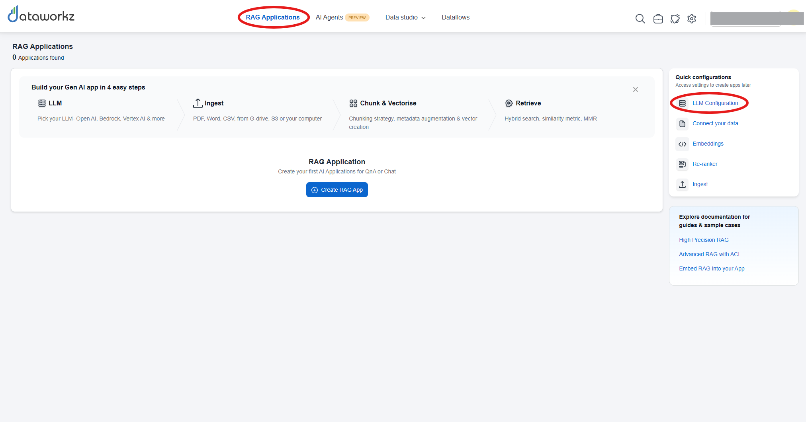

3. Click on the `Add New LLM` button

- If you are using OpenAI then pick the following values - 
```
Type: Generative
Deployment Type: OpenAI
Model: gpt-4
Name: OpenAI_gpt_4
Api Key: <your openai api key here>
Max Response Length: 600
Temperature: 0.0
Frequency Penalty: 0
Presence Penalty: 0
```

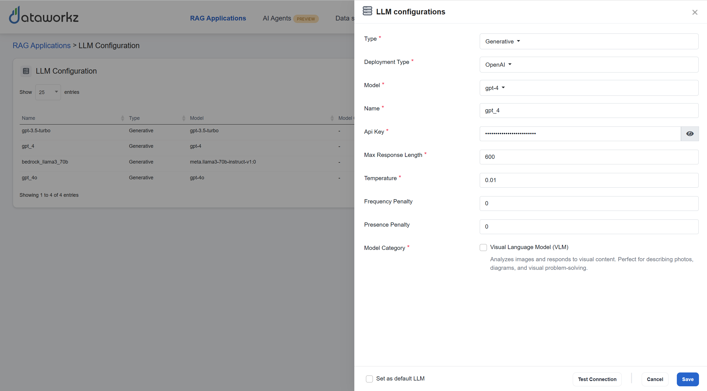

- If you are using Bedrock then pick the following values - 
```
Type: Generative
Deployment Type: AmazonBedrock
Model: meta.llama3-70b-instruct-v1:0
Name: llama3_70b
AWS Region: <your aws region>
AWS Key: <your aws key>
AWS Secret: <your aws secret>
Max Response Length: 600
Temperature: 0.0
```
- You can copy the id of the LLM Configuration which will be used later to populate the .env.local file

#### Step 4.1.2. Create RAG Application
- Click on `RAG Applications` in the main menu
- Click the `Create RAG app` button to start the process of creating a RAG app

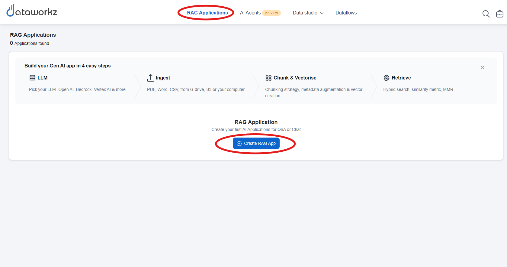

- Select the option 'Create with Default settings' in the dialog that launches

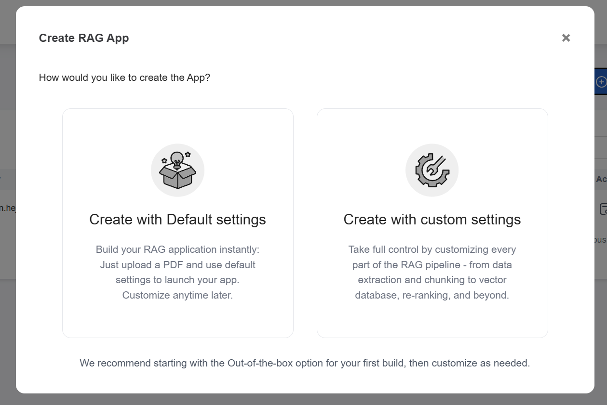

- In RAG Application Name provide the following value - `Leafy_Portal_Policies`
- Pick the LLM you configured in the previous step 
- Click `Upload from computer`
Note: You will likely see a different value for 'Source limit' specific to your account.

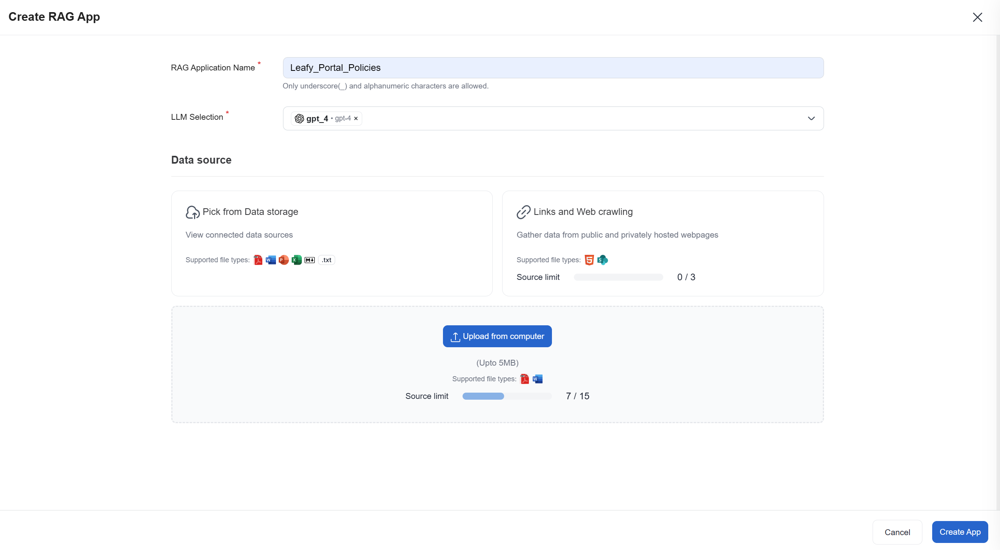

- Locate the file `LeafyCorpPolicy.pdf` in the `resources` folder where you cloned this repo
- Wait for the upload to complete and then choose `Create App`
- It will add an entry to the RAG Applications table for the Leafy_Portal_Policies RAG Applications. Give it a few minutes to complete ingesting, chunking, vectorizing and creating the App. When the RAG App is ready, the search action will enable and all sections say `View Details`.


- You can click on the document search icon under `Actions`
- In the search page try asking a question like - `When can an order be cancelled?`. You should see an answer to the question coming from the policy document we uploaded.
- Try another question - `What is the returns process?`

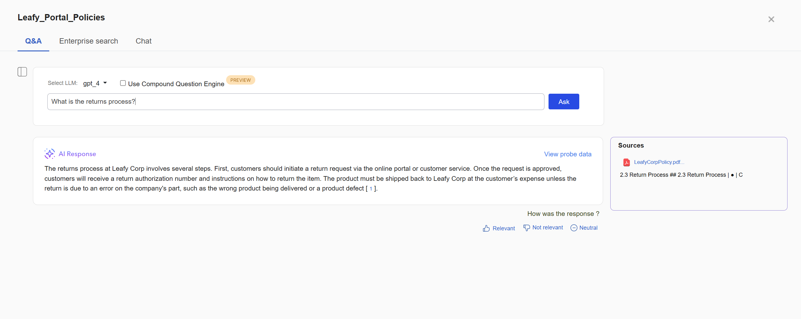

Congratulations! You have created a RAG application for Store policies. 


### Step 4.2. Create AI App Tool
Now that we have our RAG Application, lets wrap it in a Tool so it is available for Agents to use. To do this follow these steps - 
- Click on `AI Agents` in the top menu
- On the right side you will see the list of tools. Click on `Create Tool`

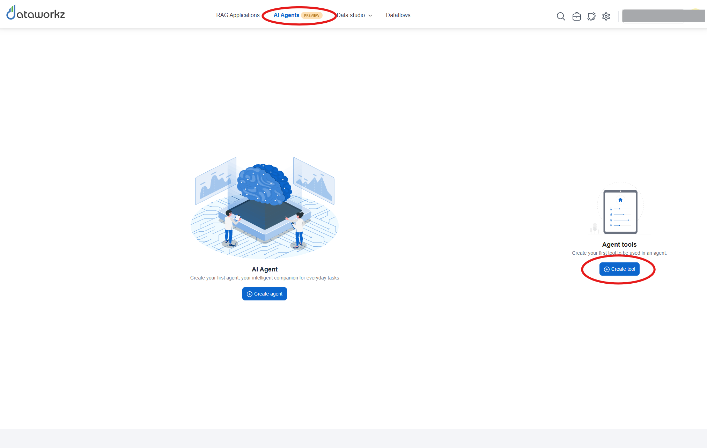

- From the list of options select `AI app`
Note: You might see a different list depending on changes to the list of tools


- From the UI that appears enter the following - 
```
Tool name: GetLeafyPortalPolicyDetails
Description: Get answers to questions around store policies such as shipping, returns, cancellations, etc.
AI Application: Leafy_Portal_Policies
LLM: <pick the LLM you configured for this RAG Application in Step 4.1.2>
Examples: Pick the example questions you tried as examples - leave empty otherwise
```
- Press Save

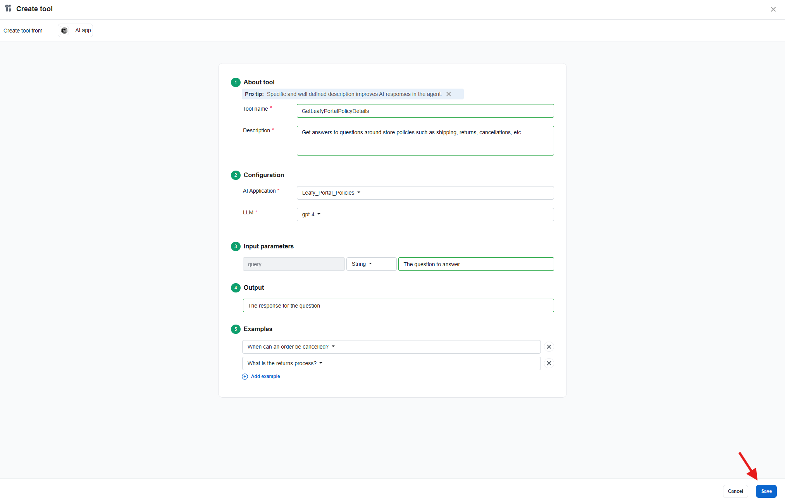

You have created the RAG Application as a tool for Agents to use!

### Step 4.3. Create Mongo Agent Tool
We need to provide Agents access to the Mongo data. For this we are going to connect to the MongoDB and create a Tool for the Agent to use.

### Step 4.3.1. Setup MongoDB connection within Dataworkz
- Click on the the gear icon on the top right (the tooltip says Configurations)


- Click on `Databases` and then on MongoDB. In this screen, we will add details to connect to the correct MongoDB cluster. 

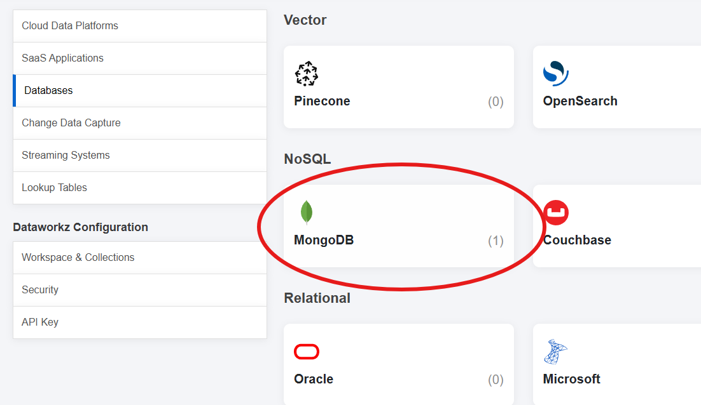

- Select `Add New Configuration`. 

**Use your own MongoDB** If you chose to use your own MongoDB, then please enter the database name in `Database Name`. And enter the authentication details specific to your configuration. 

**Use Dataworkz provided MongoDB** If you are using the Dataworkz hosted MongoDB then fill-in the following values - 
```
Database Name: leafy_popup_store
Authentication: Username and Password
Host server: agenticrag.8inaw.mongodb.net
User name: dataworkz
Password: agenticragmadeeasy
```

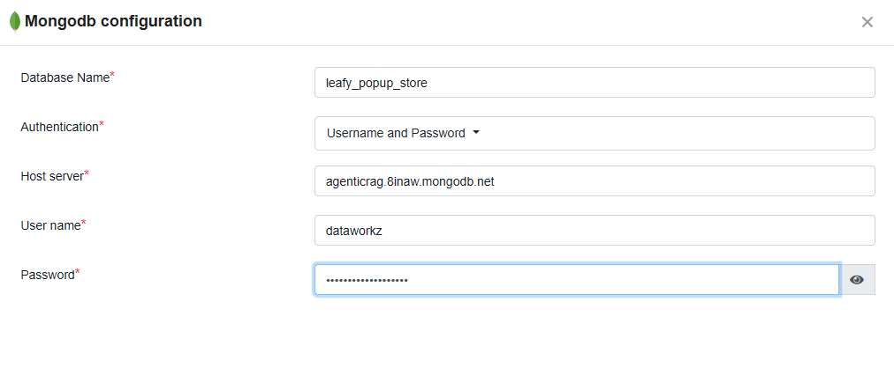

- Test Connection - your connection must be successful to proceed
- Save

In the list of MongoDB connections, you should now see the entry you just created. 

### Step 4.3.2. Create Tool to connect to MongoDB
Dataworkz Agents are composed of Tools. In this step, we will create a MongoDB tool for our `orders` collection. This will allow our Agent access to our MongoDB data. Our MongoDB Tool returns an Order object (details of an order) for a specified orderId. Therefore, we will make orderId a parameter to the tool that will be passed to it during execution by the Agent. The Agent will extract the orderId from the user's question or the conversation history.

- Click on `AI Agents` in the top menu
- On the right side you will see the list of tools. Click on `Create Tool`
- From the list of options select `MongoDB`
- In the page that appears, please enter the following - 
```
Tool name: GetLeafyPortalOrder
Description: Get order details for an order in the Leafy Portal Online Ecommerce Store.
```
- In the `Configuration` section we are going to select our `orders` collection. Pick the MongoDB configuration that you had created in the previous section. Then pick the database - `leafy_popup_store` and finally pick the `orders` collection.
- In the Filter section we are going to specify the bson filter that will let us query for a given order using its orderId. We will parameterize the orderId and refer to it using the format `${orderId}`
```
{ "_id": { "$oid": ${orderId} } }
```
- You should see the Input parameters section get automatically populated with a single entry for `orderId`. Specify a description for orderId to help the Agent understand what it is.
```
Name: orderId
Type: String
Description: the order id of the order the user is interested in
```
- Leave the Projections section blank
- In the `Output` section replace the contents with the following json. It describes the output of a single order object
```json
{
  "name": "Order",
  "description": "An object that represents an order in the system",
  "fields": {
    "_id": {
      "name": "string",
      "description": "the id of the order"
    },
    "shipping_address": {
      "name": "string",
      "description": "the address to where the products are being shipped"
    },
    "status_history": {
      "name": "StatusHistory[]",
      "description": "the list of changes to the status of the order with the date. The current status is the most recent value",
      "fields": {
        "status": {
          "name": "string",
          "description": "The new status of the order - values are from [In process,Cancelled,Delivered,Ready for pickup,In Transit,Customer in Store,Ready for delivery,Picked up from warehouse]"
        },
        "timestamp": {
          "name": "integer",
          "description": "the epoch value (milliseconds) of the time at which the status change was made"
        }
      }
    },
    "products": {
      "name": "Product[]",
      "description": "a list of products that are part of this order",
      "fields": {
        "_id": {
          "name": "string",
          "description": "the id of this product"
        },
        "amount": {
          "name": "integer",
          "description": "the number of items of this product that are in the order"
        },
        "brand": {
          "name": "string",
          "description": "the brand of the product"
        },
        "name": {
          "name": "string",
          "description": "the name of this product"
        },
        "code": {
          "name": "string",
          "description": "the code or sku of this product"
        },
        "price": {
          "name": "Price",
          "description": "The price of this product",
          "fields": {
            "amount": {
              "name": "decimal",
              "description": "The numerical value of the price"
            },
            "currency": {
              "name": "string",
              "description": "the currency of the price - e.g. USD, UBP, INR, etc"
            }
          }
        }
      }
    },
    "type": {
      "name": "enum",
      "description": "The type of order - one of ['Buy Online, Get Delivery at Home','Buy Online, Pickup in Store']"
    }
  }
}
```

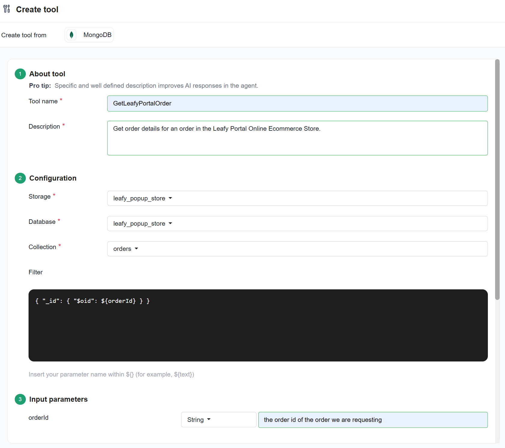

- We are now ready to test our MongoDB Tool. On the right side section, provide the value `675754fce4caed6fae71f003` for orderId. This is a known orderId in the MongoDB orders collection and we are expecting to see a result when we `Test`. On Test you should see the result that fetches the order details of that orderId.

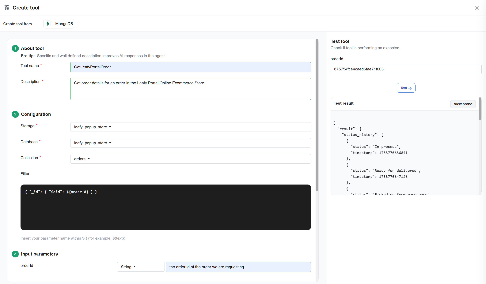

- Save

Congratulations! You have now saved a MongoDB Tool!

### Step 4.4. Create and test your Agent
- Click on `AI Agents` in the main menu
- Click on the `Create Agent` button
- In the page that appears paste the following text. We are describing the behavior of the agent we desire. The Agent Builder will analyze these statements and generate an Agent for us. If all goes well, we will have a working Agent with minimal steps and no coding at all.
```
The agent will be a customer support agent and help Leafy Portal customers with their orders. The agent needs to represent the online ecommerce portal Leafy Portal in all responses and be polite and professional at all times. When the agent cannot answer the user's question, it needs to suggest the following - "I could not follow the question. To understand what I can do you can try 'What can you do?'. Please try rephrasing your question and if the answer is not satisfactory then please talk to a human agent."
Users should be able to do the following - 
- Ask questions around store policies (like an FAQ) e.g. Do you ship internationally? Do you allow returns? How long will refunds take?
- Operate on a specific order. If the order id is not clear from the context, the agent should ask the user for the order they want to operate on. We also want to ensure that the operations performed are based on store policies. e.g. What is the status of order 123? Can I cancel order 342?

```

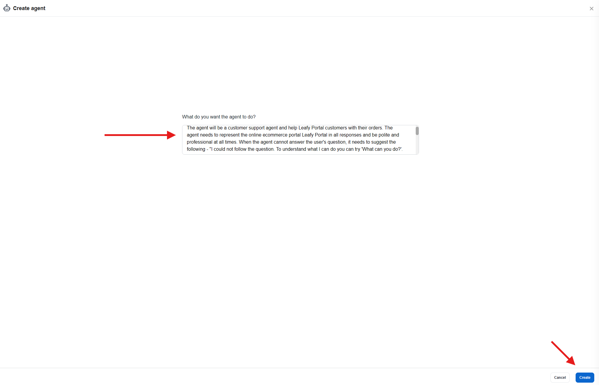

- Click on `Create`. The Agent Builder will take a few moments to process and analyze this input. Once it is done you will see the Agent specification that describes the behaviour of the agent. You should see 2 scenarios (your specific scenarios may be named differently from the example here because the Agent Builder generates different text in each run) - one that is an `FAQ` (or similar) and one that is `OrderOperations` (or similar). Other scenarios generated are common to all Agents.
Note: Your agent name may be different - it is generated by the AgentBuilder. You can edit to provide a name of your liking.

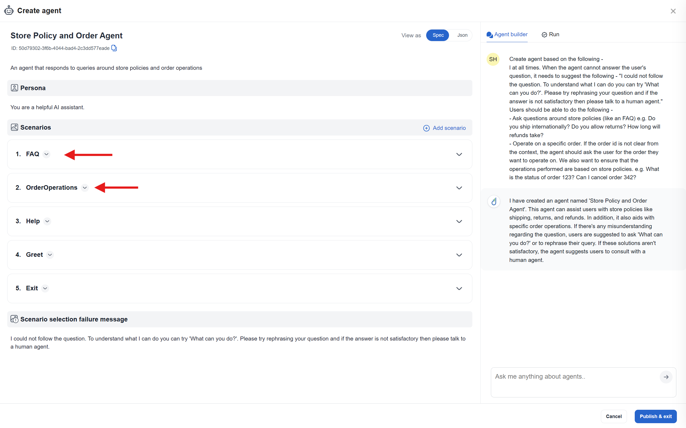

- Click on the `FAQ` scenario in the left section - it should expand. Under Tool References you might see a suggestion to include the `GetLeafyPortalPolicyDetails` AI App tool we created in the previous section. Select `Add`. If you do not see it then you can click on `View all tools` and locate `GetLeafyPortalPolicyDetails` and click on `Use tool` next to it. After this you should see `GetLeafyPortalPolicyDetails` under Tool References

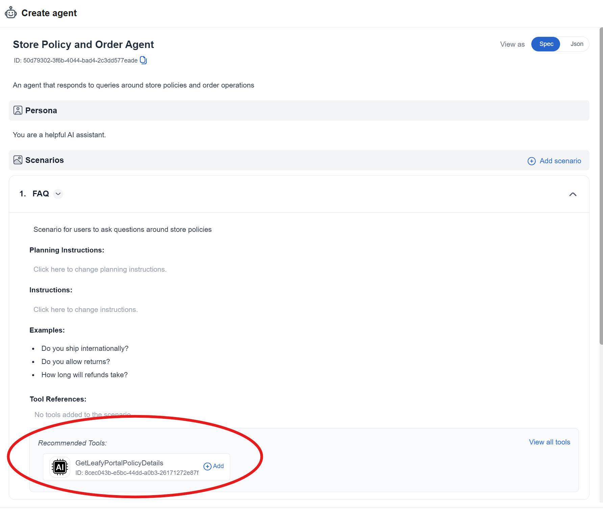

- Click on the `OrderOperations` scenario in the left section - it should expand. You might see the tool `GetLeafyPortalOrder` suggested. If so, add it. If not, click on `View all tools` and add `GetLeafyPortalOrder` to this scenario. We also want to add the `GetLeafyPortalPolicyDetails` tool this scenario so it has access to the store policies. Repeat the steps of clicking on `View all tools` and locating `GetLeafyPortalPolicyDetails` and clicking on `Use this tool` to add it to this scenario.

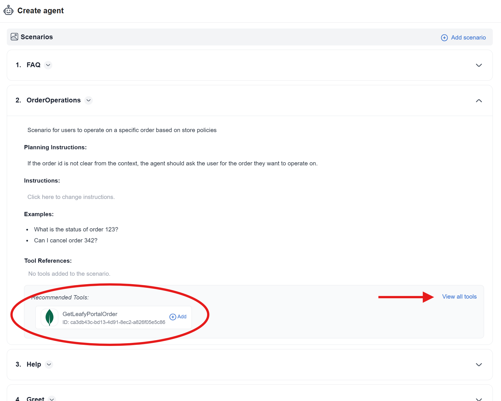

- We also want to add the `GetLeafyPortalPolicyDetails` tool this scenario so it has access to the store policies. Repeat the steps of clicking on `View all tools` and locating `GetLeafyPortalPolicyDetails` and clicking on `Use this tool` to add it to this scenario.

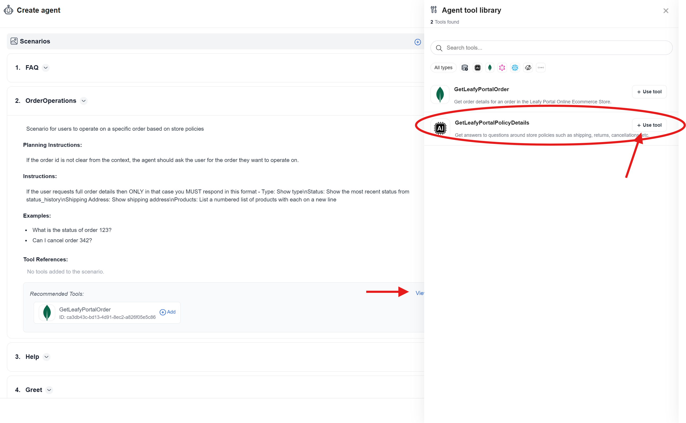

- Let's do one more step to make the result of the chatbot a little better. Click on the `OrderOperations` scenario and click on Instructions (not Planning Instructions). Replace the contents with these - 
```
If the user requests full order details then ONLY in that case you MUST respond in this format - Type: Show type\nStatus: Show the most recent status from status_history\nShipping Address: Show shipping address\nProducts: List a numbered list of products with each on a new line
```
- Click anywhere outside the field to accept the changes

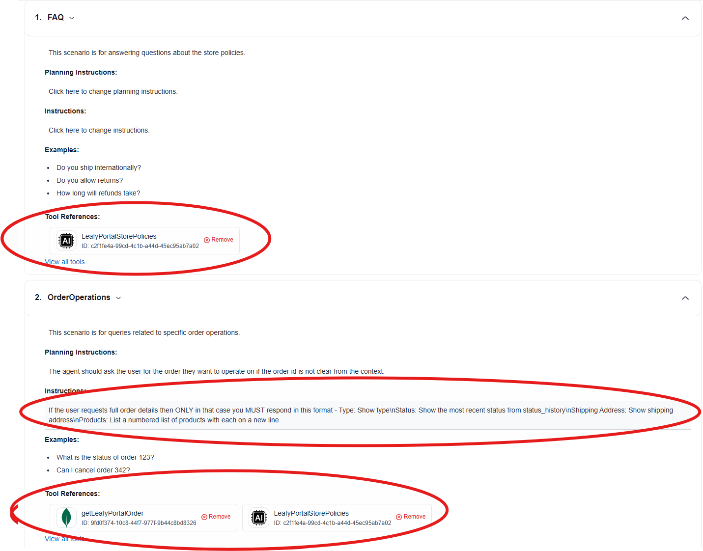

- Click on the `Run` tab on the right section of the page. In the chat box type `What can you do?` - you should see help text about the assistant itself. You can also type `Can you provide details for order 675754fce4caed6fae71f003?` and you should see order details for that order. Something like - 
```
Type: Buy Online, Get Delivery at Home
Status: Delivered
Shipping Address: Calle de Londres 247, Mexico City 62240, Mexico
Products:
1. Amazon Brand - Solimo Designer Multicolor Cup 3D Printed Hard Back Case Mobile Cover for Lenovo K5 Note
2. Amazon Brand - Solimo Designer Game Remote 3D Printed Hard Back Case Mobile Cover for Apple iPhone 6 / 6S (Logo Cut)
```
Note that the output format matches the instruction we gave the agent earlier.

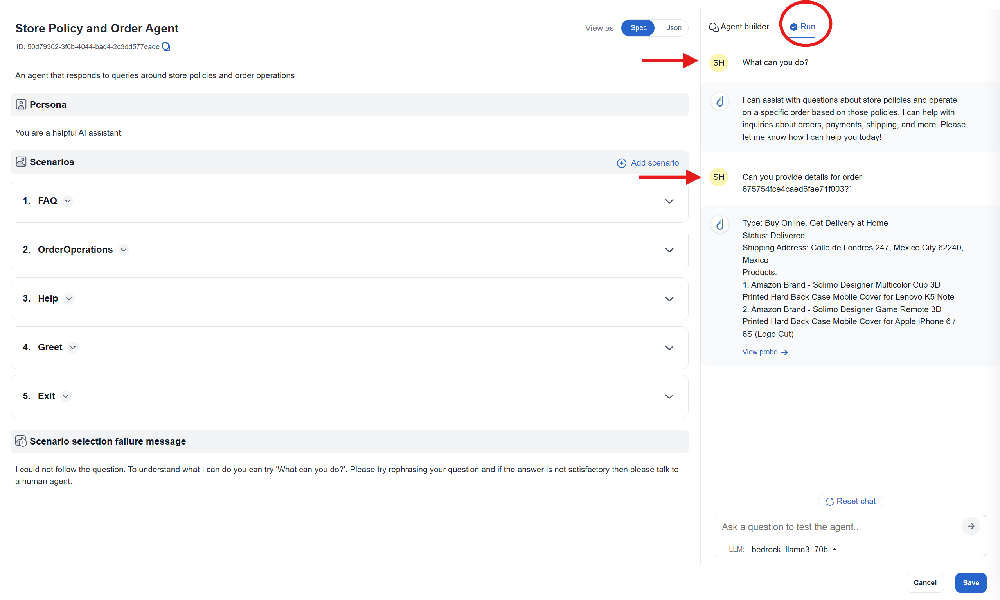


Congratulations! You have successfully created a Dataworkz Agent and connected it to a RAG Application and the MongoDB data.

Copy the id value of the Agent under its name. You will need it in the next section. 

## Step 5. Finishing the configuration

### Step 5.1. Create Dataworkz API Token
Let's create an API Token to access Dataworkz. 
- Go to the `Configuration (gear)`` icon in the top right of the Dataworkz screen.
- Click on `API Key` and then click on the `Add new API key` button
- Fill in a recognizable name and copy the api key and save it some place secure. You will not be shown the key again.


### Step 5.2. Filling in the .env.local file
Now we have completed all steps so let's fill in the blank values in our `.env.local`.
We will need the following values - 
1. Agent Id: Click on `AI Agents` in the main menu. Locate your agent in the and hover over the card and select 'Edit'. You can copy the agent id from underneath the name


2. LLM Id: Click on `RAG Applications` from the main menu. Click on `LLM Configurations` and locate your LLM in the list and copy the id from the button next to the LLM name


3. API Token: The api token created in Step 5.1

- Open `.env.local` in an editor
- Set the following values - 
```bash
...
NODE_ENV="development"
DATAWORKZ_SERVICE=https://ragapps.dataworkz.com
DATAWORKZ_LLM_ID=<Set the llm id from (2) here>
DATAWORKZ_TOKEN=<Set the dataworkz api token from (3) here>
DATAWORKZ_AGENT_ID=<Set the dataworkz agent id from (1) here>
```
At this point all values must be filled in and we are ready to run the demo!


## Step 6. Run the demo
Now you are all set to run the demo. Go back to the terminal, at the root of the application code execute the following command:

```bash
npm run dev
```

Congratulations, you have successfully set up the demo in your own environment! Open your browser and navigate to http://localhost:8080/cart. Select any user to see their cart and click on the chatbot button at the bottom right corner to see the chatbot in action.
