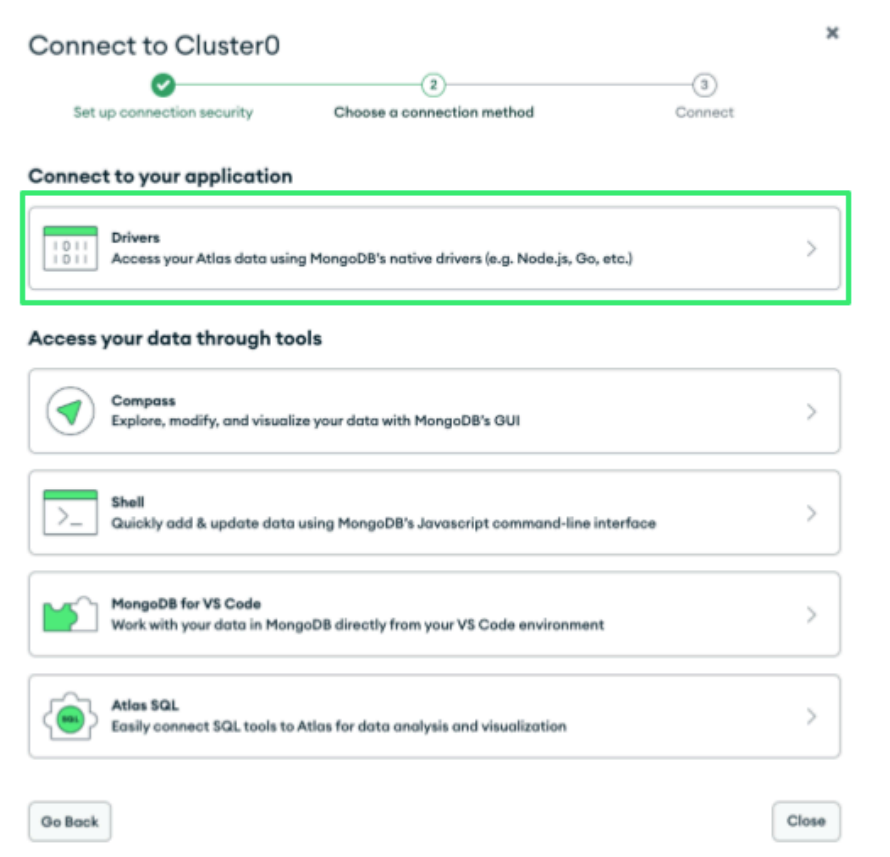
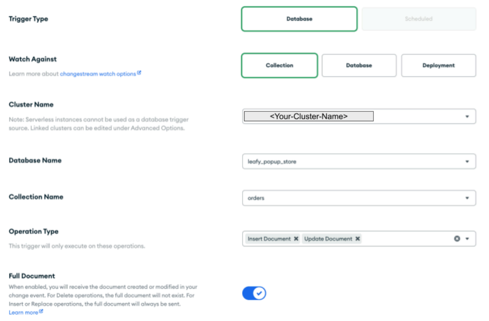
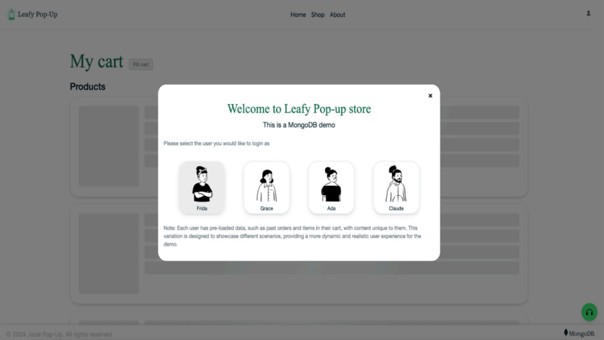
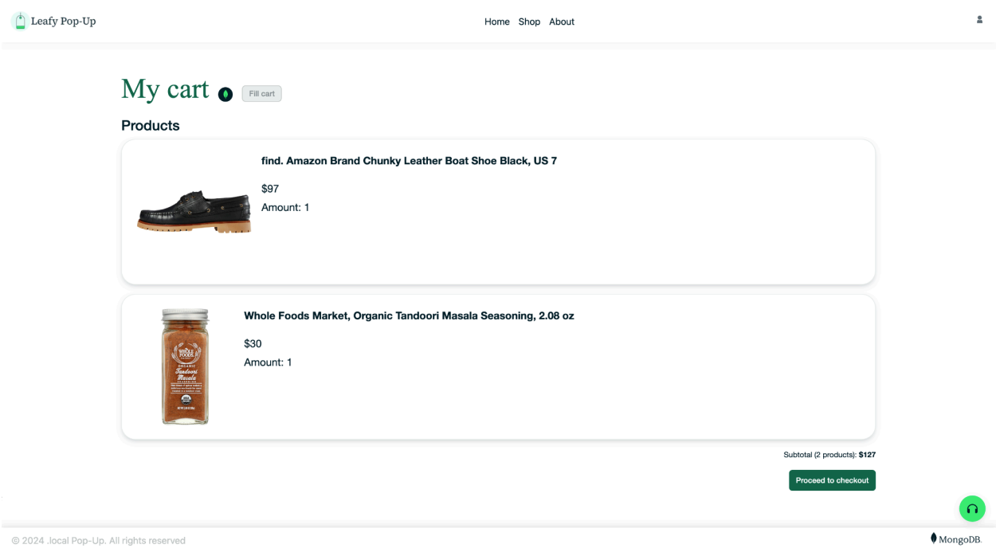
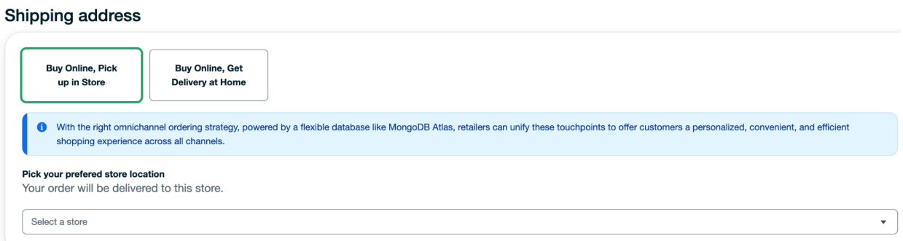
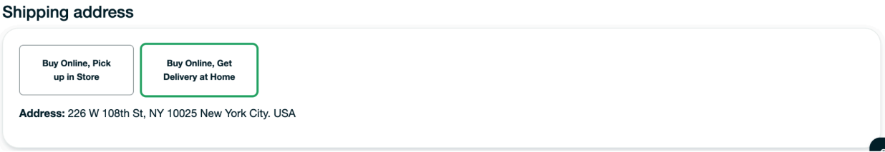
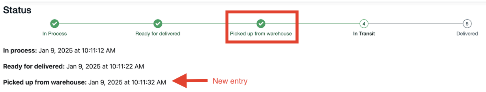
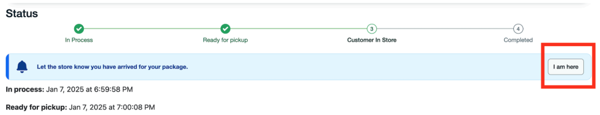
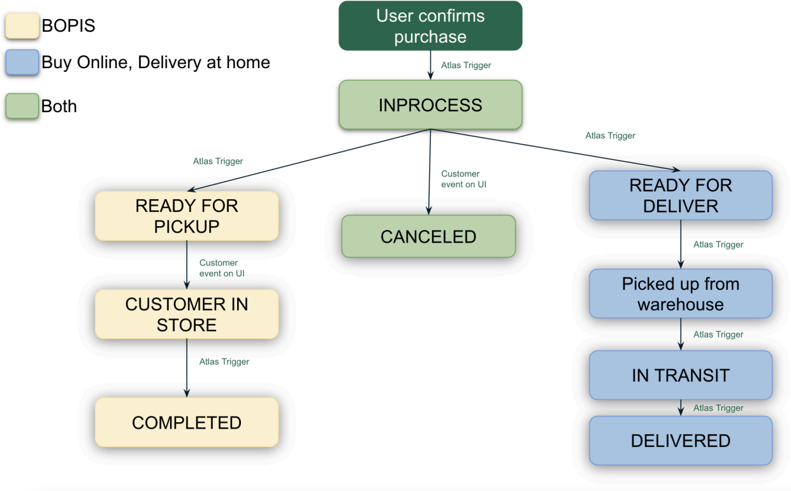

# Omnichannel ordering solution

## Table of Contents
<details>
  <ol>
    <li><a href="#prerequisites">Prerequisites</a></li>
    <li><a href="#initial-configuration">Initial Configuration</a></li>
    <li><a href="#demo-overview">Demo Overview</a></li>
    <li><a href="#authors-&-contributors">Authors & Contributors</a></li>
    </ol>
</details>

## Prerequisites

Make sure to have the following tools to follow along smoothly and run this demo on your own environment.
* MongoDB Atlas Account. Create an Atlas account at https://cloud.mongodb.com and provision a Cluster. You can follow the instructions from this article to set up your Cluster.
* Install Node. This will be required to install the node modules which contain all the necessary packages to run our demo. 
* Install Git. This will be required to clone the demo repository.

## Initial Configuration

### Step 1. Clone the repository
Start by obtaining the demo code. Open your terminal, navigate to the directory where you want to store the code, and run the following command:

git clone https://github.com/mongodb-industry-solutions/retail-store-v2.git

### Step 2. Set up environment variables and install dependencies
Navigate to the project directory and create a file called .env.local at the root level. This file is essential for managing configuration settings, especially when it contains sensitive information such as private keys.

```bash
cd retail-store-v2
touch .env.local 
```

Note: For Window’s users, replace touch .env.local with echo $null >> .env.local 

Open the .env.local file that you just created, and add the following environment variables.

```bash
MONGODB_URI=
DATABASE_NAME="leafy_popup_store"
COLLECTION_NAME="orders"
NODE_ENV="development"
```

Leave the MONGODB_URI blank for now, you will retrieve its value on Step 3. 

Install the node modules executing the following command:

```bash
npm install
```

This installation might take a few moments to complete, as all the required packages are being downloaded and installed into the project. Once the command finishes executing, a new folder named ‘node_modules’ will appear at the root level of the application code, containing the installed dependencies.

### Step 3. Retrieve your connection string
A MongoDB connection string is required to connect to the cluster you created in the ‘Prerequisites’ section. Follow the steps provided in [this article](https://www.mongodb.com/resources/products/fundamentals/mongodb-connection-string#:~:text=How%20to%20get%20your%20MongoDB,connection%20string%20for%20your%20cluster.) to retrieve your connection string. 

When choosing your connection method for MongoDB, select the option labeled ‘Drivers’, as illustrated in Figure 1.



Figure 1. Atlas screen to choose a connection method.

Once you select the ‘Drivers’ option copy the provided connection string. It should look something like this:

```bash
mongodb+srv://<username>:<password>@<clusterAddress>
```

Great job! You have obtained the final variable needed for your .env.local file.  Assign the connection string to the MONGODB_URI variable replacing <username> and <password> with your actual credentials and save the changes. Your .env.local file should now resemble the following:

```bash
MONGODB_URI=mongodb+srv://<username>:<password>@<clusterAddress>
DATABASE_NAME="leafy_popup_store"
COLLECTION_NAME="orders"
NODE_ENV="development"
```

###  Step 4. Populate your database
Next, populate your database with the required data and metadata required for the demo. In the application code locate the dump/leafy_popup_store directory. Inside it, there are several .gz files which contain the data and metadata of the collections: users, products, orders, locations and carts.

Use the [mongorestore](https://www.mongodb.com/docs/database-tools/mongorestore/) command to load the data from the database dump into a new database within your Cluster.

Let's go back to your terminal, navigate to the directory /retail-store-v2 (the root level of the application code), and run the following command:

```bash
mongorestore --gzip --dir=dump/leafy_popup_store --db=leafy_popup_store --uri "mongodb+srv://<user>:<password>@<cluster-url>"
```

This command will create the database and collections and log its progress. Upon completion, you should see a log like this:

```bash
92 document(s) restored successfully. 0 document(s) failed to restore.
```

Perfect! You now have your application code with environment variables, all the dependencies installed and the database created with the required data loaded.


Curious about how the database dump was generated? Check out  the documentation for the mongodump command. 


### Step 5. Create your Atlas Trigger
The scope of this demo is to simulate an omnichannel experience for the end customer. Due to this limitation scope, backend operations are performed to mimic the behind-the-scenes processes required to update an order's status. Such as workers from the warehouse managing the order, postal services delivering packages, or store employees packing an order.

These backend operations are enabled by a [Database Trigger](https://www.mongodb.com/docs/atlas/atlas-ui/triggers/database-triggers/) that listens to the orders collection. When a new order is created, the trigger executes [an Atlas Function](https://www.mongodb.com/docs/atlas/atlas-ui/triggers/functions/#std-label-atlas-functions), which is designed in this demo to update the order status every 10 seconds, progressing through each stage until the order is marked as delivered.

To set up this Database Trigger login to your Atlas account. Once you are logged in, follow the [how-to guide](https://www.mongodb.com/docs/atlas/atlas-ui/triggers/database-triggers/#create-a-database-trigger) to learn how to create a trigger and understand the configuration form sections. Refer to Figure 2 for some specific details you will need to configure this trigger.


Figure 2. The configuration screen showing the ‘Trigger Details’ section.

As seen on the ‘Trigger Details’ section the following values are important to note:
* Trigger Type. Select Database type.
* Watch against. Select Collection
* Operation Type. Select  ‘Insert Document’ and ‘Update Document’ from the provided options.
* Name. The name of the cluster, database and collection should match the values from your .env.local file.

When you get to the ‘Event Type’ section the following values are important to note:
* Event type. Select Function
* Function. Whenever an Insert or Update event occurs in the orders collection, this function runs automatically. It receives the change event, as a parameter, which contains all relevant details about the event. 

The function code is provided within the application code at /retail-store-v2/microservices/atlas-trigger-omnichannel/updateOrderStatus.js file. Copy the entire contents of the file and paste it into the field.

Curious about which relevant details are provided by the change event? Take a look at the event object format in [this article](https://www.mongodb.com/docs/atlas/atlas-ui/triggers/database-triggers/#change-event-types) section.


Once you have created your Database Trigger you should be able to see it listed inside Atlas’ Triggers section with the status of "Enabled".

### Step 6. Run the demo
Now you are all set to run the demo. Go back to the terminal, at the root of the application code execute the following command:

```bash
npm run dev
```

Then, open your browser and navigate to http://localhost:8080/cart and you should see the interface shown on Figure 3.


Figure 3. Omnichannel Ordering demo interface.

Congratulations, you have successfully set up the demo in your own environment! Select any user to see their cart and click on ‘Proceed to checkout’ to start your Omnichannel Ordering experience.


## Demo Overview

When first accessing the demo you’ll be presented with the Login screen (Figure 4) where you can choose which user you want to login with. All users represent a customer and have the same privileges, the only variation between each user is that they have different pre-loaded data, such as their name, their address, their orders history and items in their cart. 


Figure 4. Login screen

 After choosing a Persona, you will be taken to ‘My cart’ screen (Figure 5). Here, you will see a few products already loaded to your cart. If you do not have any, don't worry we added a “Fill Cart” button to automatically add some random products to the cart so you can continue with the demo.


Figure 5. My Cart screen

Once you are ready to move forward click on the “Proceed to Checkout”.
From the ‘Checkout‘ screen you will notice the start of your Omnichannel experience. There are two shipping methods available ‘Buy Online, Pickup in store’ (BOPIS) which shows a list of available stores to pick up the order. And ‘Buy Online, Get Delivery At home’ which shows the address of that specific user.


Figure 6. BOPIS shipping method


Figure 7. Home delivery shipping method

Select your preferred shipping method and click on “Confirm & order”. This will generate the new order and redirect you to the ”Order Details” page.
Inside the ‘Order details’ page you will see slight variations depending on the shipping method you selected.:
In any order:  You first have the “Summary” section (Figure 14) which lists general info about the order. Below that, you have the “Status” showing a Stepper showing the order status progressing through each stage until the order is marked as Delivered/Completed. And at the bottom the list of products contained in the order.
Every time an order moves forward with the next status the stepper circle will turn green and a new entry will show with the timestamp that status was logged into the database.


Figure 8. Stepper on ‘Status’ section

Every order will automatically move from status every 10 seconds thanks to an Atlas Trigger. The only status that depends on the user is the “Customer in store” status from the BOPIS orders. This status is to indicate to the store that the customer is physically at the store and ready to pick up the order. So the customer has to click on the “I am here” button to change of status


Figure 9. Customer alert to notify its presence to the store

‘BOPIS’ orders only: It has specific states displayed in Figure 10. 
‘Buy Online, Get Delivery at Home’ orders only: It has specific states displayed in Figure 16.


Figure 10. Progression of an order through various states

To get the full glimpse of the power of change streams open two screens: One with the Order details and another one with the list of Orders. You will notice the order status changing in real time for both screens, providing a unified experience for the user. 
Another highlight is the ability to create orders with different shipping methods having very different types and amounts of status. This is possible thanks to the flexibility of the document model. It’s schema-free and polymorphism allows to have documents on the same collection with different versions of a document schema.


## Authors & Contributors

### Lead Authors   
Prashant Juttukonda - Principal

Rodrigo Leal - Principal

Genevieve Broadhead - Global lead, retail solutions

[Angie Guemes](https://www.linkedin.com/in/angelica-guemes-estrada/) – Developer & Maintainer 

Florencia Arin – Developer & Maintainer 
